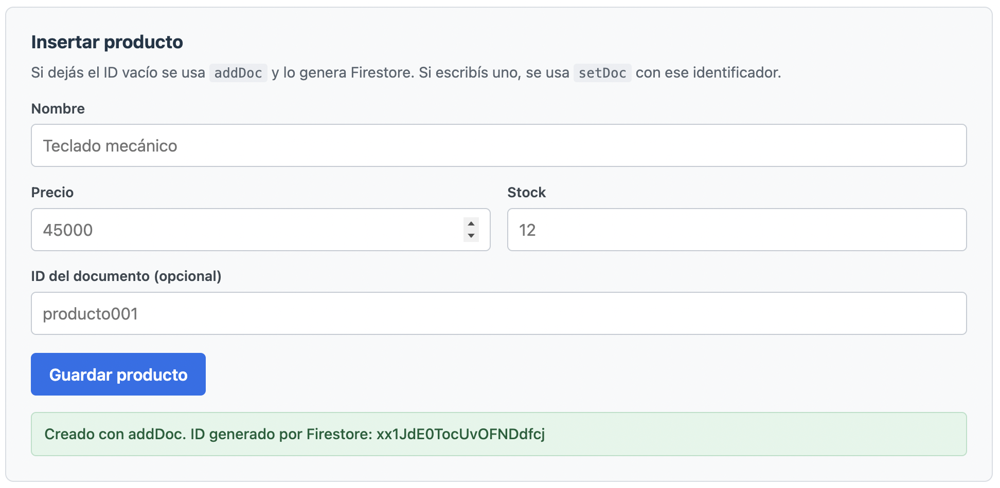
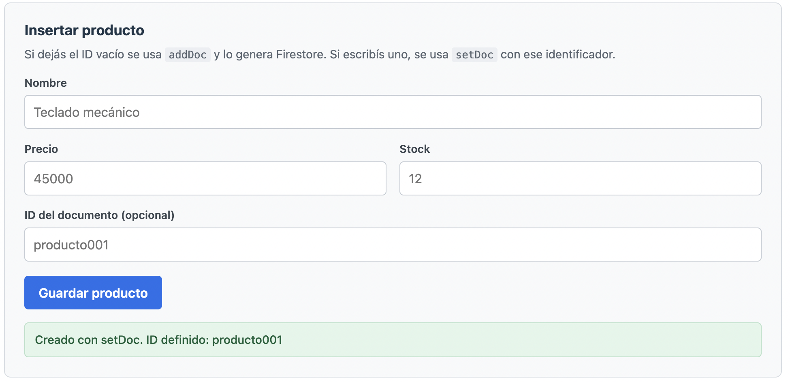
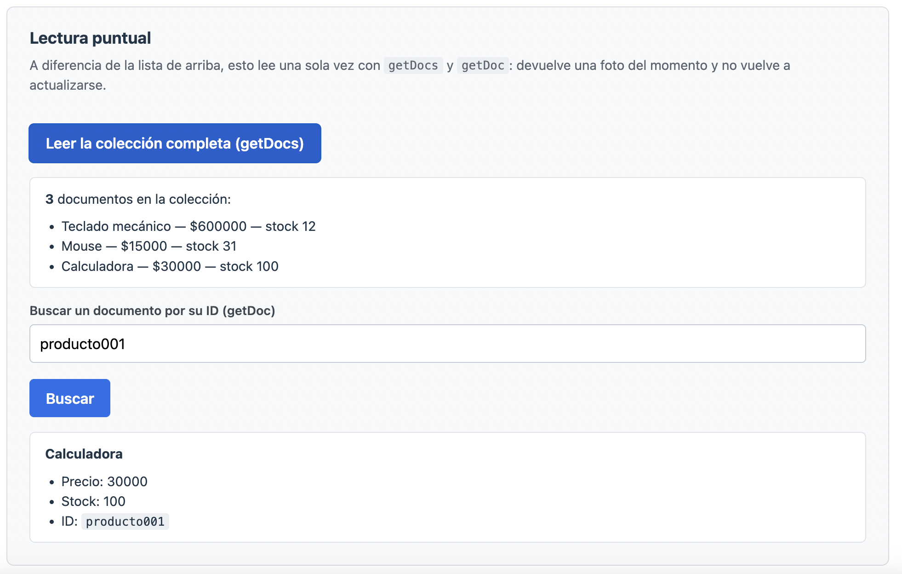
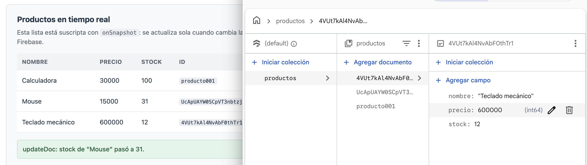
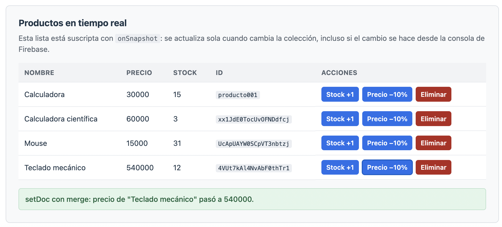
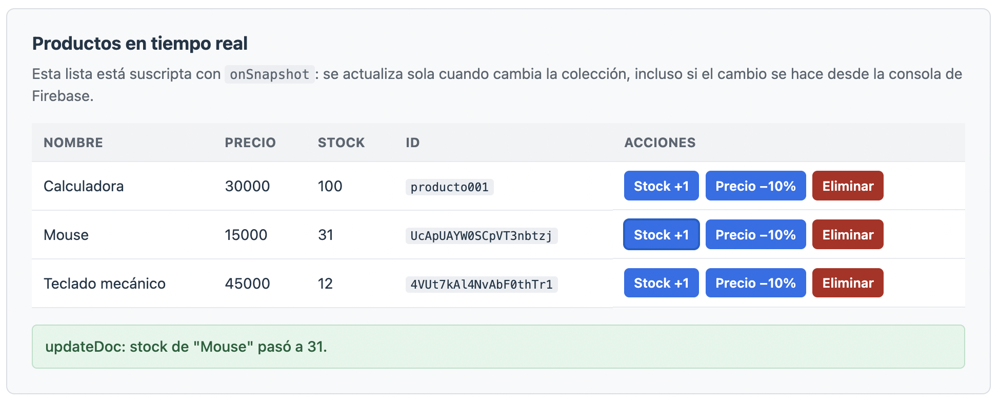
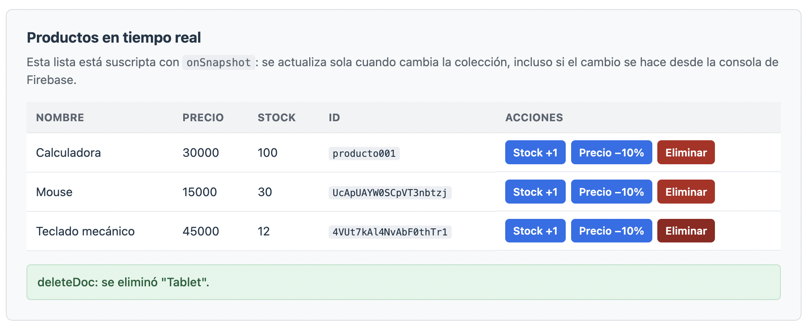
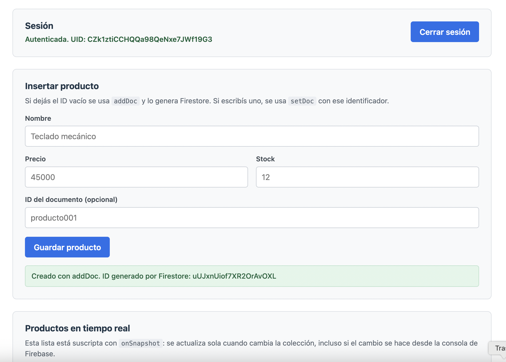
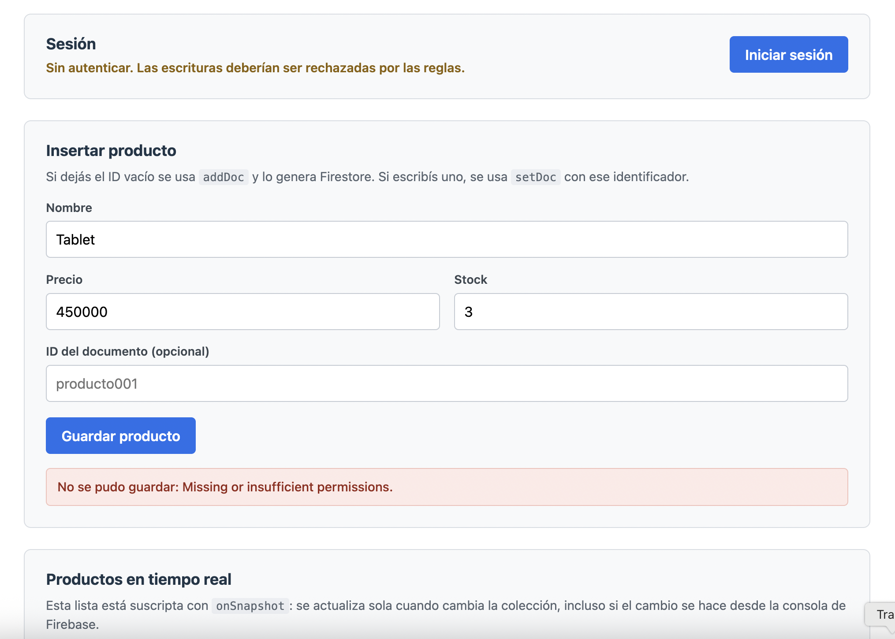

# Mi primer CRUD en Firestore

Aplicación en React conectada a **Cloud Firestore** que implementa las cuatro
operaciones de un CRUD sobre una colección de productos: creación con
identificador automático y definido, lectura puntual y en tiempo real,
actualización total y parcial, y eliminación. Incluye reglas de seguridad que
restringen la escritura a usuarios autenticados, con la prueba de ambos
escenarios.

Continúa el trabajo de la Unidad 1, que dejó la conexión entre React y Firebase
resuelta. Usa el mismo proyecto de Firebase.

## Funcionalidades

- Inserción de documentos con identificador generado por Firestore y con identificador definido por la aplicación.
- Lectura de la colección completa y de un documento puntual por su ID.
- Lista suscripta a los cambios de la colección, que se actualiza sin recargar la página.
- Actualización parcial de documentos por dos mecanismos distintos.
- Eliminación de documentos con verificación en la interfaz.
- Inicio y cierre de sesión, y reglas de seguridad que distinguen lectura de escritura.

## Operaciones CRUD

Todas las llamadas a Firestore están reunidas en `src/servicios/productos.js`.
Los componentes no usan el SDK directamente: llaman a estas funciones.

| Operación | Función | SDK | Dónde se usa |
|---|---|---|---|
| Crear con ID automático | `crearProductoIdAutomatico` | `addDoc` | Formulario, con el campo de ID vacío |
| Crear con ID definido | `crearProductoConId` | `setDoc` | Formulario, escribiendo el ID |
| Leer la colección | `obtenerTodosLosProductos` | `getDocs` | Tarjeta de lectura puntual |
| Leer un documento | `obtenerProductoPorId` | `getDoc` | Tarjeta de lectura puntual |
| Leer en tiempo real | `suscribirseAProductos` | `onSnapshot` | Tabla de productos |
| Actualizar parcialmente | `actualizarConMerge` | `setDoc` con `{ merge: true }` | Botón "Precio −10%" |
| Actualizar un campo | `actualizarCampo` | `updateDoc` | Botón "Stock +1" |
| Eliminar | `eliminarProducto` | `deleteDoc` | Botón "Eliminar" |

### Crear: `addDoc` y `setDoc`

`addDoc` recibe la referencia a la **colección** y deja que Firestore genere el
identificador. `setDoc` recibe la referencia a un **documento** concreto, con un
ID elegido por la aplicación. La diferencia importa cuando el identificador
tiene que ser predecible: `setDoc` permite escribir siempre en el mismo
documento, mientras que `addDoc` crearía uno nuevo en cada llamada.

`setDoc` sobrescribe el documento completo: los campos que no se envían se
pierden. Por eso existe la variante con `merge`.

### Leer: `getDocs`, `getDoc` y `onSnapshot`

`getDocs` y `getDoc` son lecturas únicas: devuelven el estado de la colección o
del documento en el momento de la llamada y no vuelven a actualizarse.
`onSnapshot`, en cambio, deja una suscripción abierta: recibe una primera
instantánea y luego una nueva cada vez que algo cambia, sin importar si el
cambio lo hizo esta aplicación, otra pestaña o la consola de Firebase.

La suscripción devuelve una función para cancelarla, que el componente ejecuta
al desmontarse para no dejar escuchas colgadas.

### Actualizar: `merge: true` y `updateDoc`

Los dos modifican campos sin tocar el resto del documento, pero se comportan
distinto cuando el documento no existe: `setDoc` con `{ merge: true }` lo crea,
mientras que `updateDoc` falla. `updateDoc` es la opción correcta cuando el
documento tiene que existir sí o sí y se prefiere el error a una creación
silenciosa.

### Eliminar: `deleteDoc`

Borra el documento indicado. Como la tabla está suscripta con `onSnapshot`, la
fila desaparece sola: no hace falta volver a pedir los datos.

## Tecnologías

- React 19
- Firebase 12 (Firestore y Authentication)
- Vite 8
- CSS puro

## Instalación y uso

```bash
git clone https://github.com/candelacorradin/ReactJS-Modulo3-Unidad2.git
cd ReactJS-Modulo3-Unidad2
npm install
```

El repositorio no incluye el archivo `.env`: cada persona que clone el proyecto
debe apuntarlo a su propio proyecto de Firebase. Antes de levantar la aplicación
hay que crearlo a partir de la plantilla incluida:

```bash
cp .env.example .env
```

y completar los valores con los del propio proyecto, disponibles en la consola
en **Configuración del proyecto → Tus apps**. Luego:

```bash
npm run dev
```

La aplicación queda disponible en `http://localhost:5173`.

En el proyecto de Firebase hacen falta además dos cosas: una base de **Cloud
Firestore** creada, y el proveedor **Anónimo** habilitado en Authentication.

## Variables de entorno

Vite solo expone al navegador las variables cuyo nombre empieza con `VITE_`.
Cada una corresponde a una clave del objeto de configuración de Firebase:

| Variable | Clave en `firebaseConfig` |
|---|---|
| `VITE_FIREBASE_API_KEY` | `apiKey` |
| `VITE_FIREBASE_AUTH_DOMAIN` | `authDomain` |
| `VITE_FIREBASE_PROJECT_ID` | `projectId` |
| `VITE_FIREBASE_STORAGE_BUCKET` | `storageBucket` |
| `VITE_FIREBASE_MESSAGING_SENDER_ID` | `messagingSenderId` |
| `VITE_FIREBASE_APP_ID` | `appId` |

## Reglas de seguridad

El archivo `firestore.rules` está versionado en la raíz del repositorio:

```
rules_version = '2';

service cloud.firestore {
  match /databases/{database}/documents {
    match /productos/{productoId} {
      allow read: if true;
      allow write: if request.auth != null;
    }
  }
}
```

La lectura queda abierta y la escritura exige una sesión iniciada. Las
colecciones que no aparecen en las reglas quedan denegadas por defecto: en
Firestore, lo que no está explícitamente permitido está prohibido.

## Estructura del proyecto

```
├── .env.example                     Plantilla de variables de entorno
├── .gitignore                       Excluye node_modules, dist y el archivo .env
├── firestore.rules                  Reglas de seguridad publicadas en el proyecto
├── index.html                       Documento base
├── vite.config.js                   Configuración de Vite
├── screenshots/                     Capturas de las operaciones
└── src/
    ├── main.jsx                     Punto de entrada
    ├── App.jsx                      Composición de la pantalla y estado de sesión
    ├── App.css                      Estilos de los componentes
    ├── index.css                    Estilos globales
    ├── firebase/
    │   └── config.js                Inicialización única de Firebase, Firestore y Auth
    ├── servicios/
    │   ├── productos.js             Las ocho operaciones sobre Firestore
    │   └── sesion.js                Inicio, cierre y observación de sesión
    └── componentes/
        ├── Sesion.jsx               Estado de la sesión y botón de acceso
        ├── FormularioProducto.jsx   Inserción con addDoc y setDoc
        ├── ListaProductos.jsx       Lectura en tiempo real, actualización y borrado
        └── LecturaPuntual.jsx       Lecturas únicas con getDocs y getDoc
```

## Capturas de pantalla

### Inserción con ID automático (`addDoc`)



### Inserción con ID definido (`setDoc`)



### Lectura de la colección y de un documento (`getDocs` y `getDoc`)



### Lectura en tiempo real (`onSnapshot`)

La aplicación a la izquierda y la consola de Firebase a la derecha muestran el
mismo documento con los mismos valores.



### Actualización parcial con `setDoc({ merge: true })`

El precio cambia y el nombre y el stock del documento se mantienen.



### Actualización de un campo con `updateDoc`



### Eliminación con `deleteDoc`

El producto eliminado ya no figura en la tabla.



## Notas sobre las pruebas de reglas de seguridad

Las reglas se probaron desde la propia aplicación, en los dos escenarios que
pide la consigna.

**Con sesión iniciada**, la inserción se completa y la aplicación muestra el ID
del documento creado:



**Sin sesión**, la misma operación es rechazada por Firestore con el error
`Missing or insufficient permissions`:



En la segunda captura la tabla de productos sigue visible. No es un error: la
regla `allow read: if true` mantiene la lectura abierta y solo restringe la
escritura, de modo que el permiso se evalúa por operación y no como un acceso
total al recurso.

La autenticación usada es **anónima**. Alcanza para lo que exige la regla,
porque `request.auth` deja de ser nulo, pero no identifica a una persona: cada
sesión anónima es una cuenta nueva y descartable. Una aplicación real usaría un
proveedor con identidad y las reglas comprobarían además a quién pertenece cada
documento.

## Problemas encontrados y cómo se resolvieron

- **Las reglas de seguridad se suman, no se reemplazan.** Al escribir la regla nueva se dejó también la del modo de prueba, que concedía lectura y escritura a cualquier documento hasta una fecha futura. Como Firestore permite una operación si *alguna* regla la habilita, y no existe una denegación que gane sobre un permiso, las escrituras sin autenticar seguían funcionando y la restricción parecía no aplicarse. Se resolvió eliminando el bloque `match /{document=**}` del modo de prueba.
- **Las variables de entorno llegan como `undefined`.** Vite lee el archivo `.env` solo al arrancar. Si el servidor de desarrollo quedó corriendo mientras se creaba o editaba, hay que detenerlo y volver a ejecutar `npm run dev`. La otra causa habitual es olvidar el prefijo `VITE_`.
- **Los tipos de dato de cada campo.** Los `<input>` devuelven texto, así que `precio` y `stock` se convierten con `Number()` antes de escribirlos. Si se guardaran como cadenas, las comparaciones y el ordenamiento serían alfabéticos y `"9000"` resultaría mayor que `"45000"`. Firestore no tiene esquema y aceptaría ambos tipos en el mismo campo sin avisar.
- **Los documentos sin el campo de ordenamiento no aparecen.** La lista en tiempo real ordena por `nombre`. Un documento cargado a mano en la consola sin ese campo, o con el nombre mal escrito, queda fuera del resultado sin generar ningún error.

## Alcance de las capturas

Una imagen fija no puede demostrar que una lectura sea en tiempo real: la
captura correspondiente muestra la aplicación y la consola con los mismos
datos, pero no el instante en que se sincronizan. Lo que sí se verifica en vivo
es que al modificar un documento desde la consola de Firebase la tabla cambia
sin recargar la página.

## Créditos

**Autora:** Candela Corradin Tessa  
**Curso:** Desarrollo Full Stack — React Avanzado  
**Módulo 3 · Unidad 2:** CRUD en Firestore
